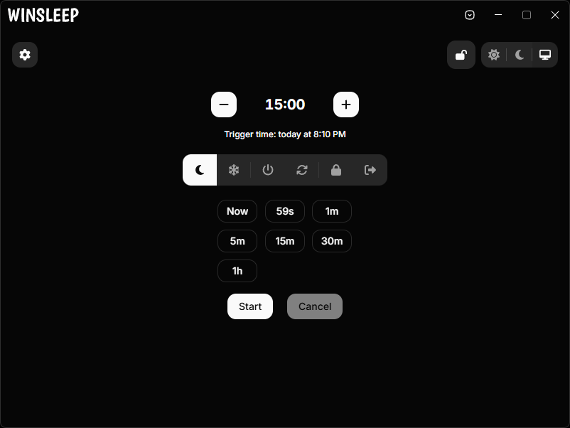

<div align="center">


# WinSleep

[![Windows][windows]](https://github.com/Autapomorph/winsleep/releases/latest)
[![Release][release]](https://github.com/Autapomorph/winsleep/releases/latest)
[![Build][build]](https://github.com/Autapomorph/winsleep/actions/workflows/release.yml)
[](./LICENSE)

**A modern, lightweight, and blazing-fast Windows desktop utility for scheduled system power actions.**

[Features](#-key-features) • [Hotkeys](#️-hotkeys) • [Development](#-development--build) • [License](#-license)

<br />



</div>

---

## ✨ Key Features

### ⏳ Flexible Timer Modes
- **Interval Mode**: Set countdown timers in seconds, minutes, or hours with quick increment/decrement controls.
- **Timestamp Mode**: Schedule system events for a precise target date and time (today, tomorrow, or a custom date).
- **Quick Presets & Custom Adjustments**: Fast one-click presets and customizable time adjustment steps.

### 🔋 Comprehensive System Actions
Direct native Windows integration for all critical power actions:
- **Sleep & Hibernate**: Triggered via direct low-level Win32 APIs.
- **Shutdown & Restart**: Controlled system power-off and reboots.
- **Lock Workstation & Sign Out**: Instant or scheduled screen locking and user logoff.

### 🛡️ Smart Protection & Customization
- **Accidental Click Protection (Lock Mode)**: Prevent accidental aborts or modifications while a timer is ticking.
- **Customizable Warning Notifications**: Receive native Windows alerts before actions execute (with customizable trigger times and sound effects).
- **System Tray Integration**: Minimize or close to tray, monitor remaining time in tray tooltip, and control playback from the context menu.
- **Auto-Launch & Background Mode**: Optional startup on Windows boot and silent start in minimized state.

### 🎨 Modern UI & Experience
- **Theme Support**: Seamless Light, Dark, and System theme switching.
- **Multilingual Support**: Built-in English and Russian translations.
- **Automatic & Manual Updates**: Built-in updater with GitHub release changelog preview.

---

## ⌨️ Hotkeys

WinSleep is built for speed and full keyboard accessibility:

| Shortcut / Category | Action |
| :--- | :--- |
| **`Space`** | Start / Pause / Resume timer |
| **`Ctrl + Space`** | Cancel timer |
| **`Ctrl + Shift + E`** | Execute selected action immediately |
| **`+` / `-`** | Increase / Decrease timer duration |
| **`B`** | Lock / Unlock controls (protection mode) |
| **`S`** | Select action: **Sleep** |
| **`H`** | Select action: **Hibernate** |
| **`P`** | Select action: **Shutdown** |
| **`R`** | Select action: **Restart** |
| **`L`** | Select action: **Lock screen** |
| **`Q`** | Select action: **Sign out** |
| **`Ctrl + ,`** | Open / Close Settings |

---

## 🚀 Development & Build

### Prerequisites
1. **Node.js** (v24 or newer recommended)
2. **Rust & Cargo** (latest stable). Refer to the [Tauri Prerequisites Guide](https://v2.tauri.app/start/prerequisites/).

### Getting Started
```bash
# Clone the repository
git clone https://github.com/Autapomorph/winsleep.git

# Install dependencies
npm install

# Run in Tauri desktop development mode
npm run tauri dev
```

### Production Build
To compile the native Windows installer (`.exe`):

```bash
npm run tauri build
```

> [!NOTE]
> **Tauri Updater & Code Signing**: Production bundles generated for distribution require signing artifacts (`.sig`) configured in `tauri.conf.json` for the built-in auto-updater.
>
> - **In CI/CD (GitHub Actions)**: Automated releases sign bundles using `TAURI_SIGNING_PRIVATE_KEY` and generate `latest.json`.
> - **Local Builds**: To build installers locally without private signing keys, you can provide temporary signing keys via environment variables (`TAURI_SIGNING_PRIVATE_KEY`) or override the config in the CLI:
>
>   ```bash
>   npm run tauri build -- --config '{"bundle":{"createUpdaterArtifacts":false}}'
>   ```

---

## 📄 License
Distributed under the **GNU General Public License v3.0** (GPL-3.0). See [LICENSE](./LICENSE) for more details.

[windows]: https://custom-icon-badges.demolab.com/badge/Windows-0078D6?logo=windows11&logoColor=white&style=flat-square
[release]: https://img.shields.io/github/v/release/Autapomorph/winsleep?style=flat-square&color=%232d6acc&label=Version
[build]: https://img.shields.io/github/actions/workflow/status/Autapomorph/winsleep/release.yml?style=flat-square&color=%2313a135&label=Build